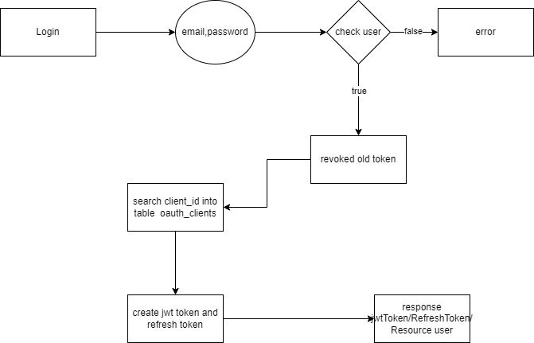

# Test colloquio 24-09

## Linguaggio e versioni

- laravel 11
- php 8.2
- node 20.11
- npm 10.2.4

## Librerie aggiuntive laravel

- laravel/passport
- darkaonline/l5-swagger

## Database

- mysql

### Dati di accesso al database

<strong>USERNAME</strong>: asugamele 
<strong>PASSWORD</strong>: 123qwe!@ 
<strong>DB_NAME</strong>: asugamele_laravel 

***

## Swagger

É stato aggiunto lo swagger, per la documentazione delle api presente all'indirizzo:

***

## Struttura del progetto

### Back-end

Questa parte conta di due api:

1. login 
2. refresh token
3. logout
4. lettura dati derivanti dall'api <a href="https://api.openbrewerydb.org/v1/breweries">https://api.openbrewerydb.org/v1/breweries</a>

#### Login

La gestione dell'auth si base sulle funzionalità presenti in passport.
La base dei dati è la tabella <i>users</i>, gestita attraverso il model user(<a href="app/Models/User.php">Model</a>).
Il controller per la gestione dell'api è <a href="app/Http/Api/User/UserController.php">UserController.php</a>. 
La funzione per questa situazione è <i>login</i>.
In questa funzione, dapprima si verifica la presenza dell'utente attraverso la classe <i>Auth</i>; 
se le credenziali sono corrette, si verifica se ci sono token attivi per questa utenza e se ci fossero, viene impostato il campo  revoked della tabella <i>oauth_access_tokens</i> a true.  
Inoltre, viene estratto il client_id relativo all'utenza dalla tabella <i>oauth_clients</i>(*). 
A questo punto, attraversdo le funzionalità del package <i>Lcobucci\JWT</i>, viene creato il <strong>JWT Token</strong> e, attraverso la classe <i>RefreshTokenRepository</i>, viene creato il refresh token.
Tutto questo, viene restitutto come risposta dell'api insieme ai dati dell'utente. 
 

Di default sono state impostate le seguenti utenze, create attraverso il seeder <a href="database/seeders/UserSeeder.php">UserSeeder.php</a> 
<table>
<thead>
<tr>
<th>Email</th>
<th>Password</th>
</tr>
</thead>
<tbody>
<tr>
<td>root@root.it</td>
<td>root@123</td>
</tr>
<tr>
<td>admin@admin.it</td>
<td>admin@123</td>
</tr>
</tbody>
</table>

<i style="font-size:12px">*: La creazione della tupla sulla tabella <strong>oauth_clients</strong>, avviene attraverso un booted presente nel model User.</i>

#### Refresh token

Questa sezione viene gestita nel controller <a href="app/Http/Api/User/UserController.php@refresh">UserController.php@refresh</a>.  
Viene passato il valore del resfresh token, derivante dall'api precedente.
Viene verificato:
- se il refresh token è corretto
- se il refresh token non è scaduto  
Se entrambe le condizioni sono verificate, il sistema imposta il campo revoked della tabella <i>oauth_clients</i> a true, revoca il refresh token e crea un nuovo token con le stesse modalità della login.
La response di questa api, sarà uguale alla response dell'api precedente.

#### Logout
Questa sezione viene gestita nel controller <a href="app/Http/Api/User/UserController.php@logout">UserController.php@logout</a>.  
In questa funzione viene revocato il token.
Se non si sono verificate eccezioni, il sistema ritorna lo stato 200.

#### Lettura dei dati

Questa sezione viene gestita nel controller <a href="app/Http/Api/ApiController/ApiController.php@get_list">ApiController.php@get_list</a>.  
La funzione prevede istanzia un nuovo <i>GuzzleHttp\Client</i>  e chiama l'api https://api.openbrewerydb.org/v1/breweries in get.

Se questa risponde positivamente, viene restitua la risposta all'interno di un JsonResponse, altrtimenti viene restituita l'eccezione.

### Front-end
